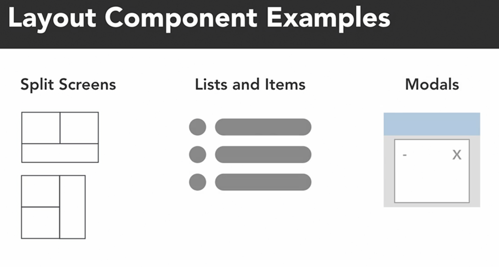
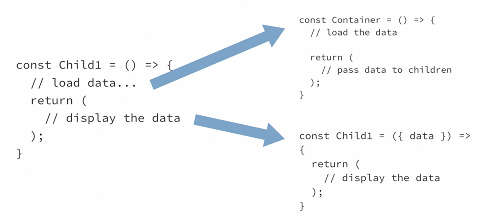

# React: Design Patterns

This project was bootstrapped with [Create React App](https://github.com/facebook/create-react-app).

## Layout Components

Layout components are components in React that deal primarily with arranging other components on the page. Some examples of this that you're probably familiar with are split screens, so arranging more than one component in different sections of the page. We also have lists and items, so displaying data in a list. And modals, is just content that gets displayed over top of the actual page.

<p align="center">
  
</p>

The main idea of layout components is that our components that we create, the main content components of our pages, shouldn't know or care where they're actually being displayed on the page.

## Container Components

Container components are basically React components that take care of all of the data loading and other data management for their child components.

Let's imagine that we have a container component with several child components inside of it. Normally what you would do, is you would just have each of those child components load their own data and then display it. So up where it says low data, you probably have a useState hook and a useEffect hook and use something like Axios or Fetch to get data from a server. Now, the problem with this is that a lot of the time we need our child components to be able to share that logic. And the way that container components solve that problem is by splitting that logic out into its own component, which is the container and the container then takes care of loading that data and passes it automatically to the children components.

<p align="center">
  
</p>

So the main idea with container components, we don't want our components to know where their data is coming from or how to manage it. We just want our components to be dumb and take some props and display whatever they need to display.

## Controlled vs Uncontrolled Components

Uncontrolled components are basically React components where the component itself keeps track of all its own internal state and really the only time we get data out of that component is when some event occurs. So this would be in the case of, let's say, a form when the user hits the Submit button. In an uncontrolled form, that would be the only time we actually know what values the inputs of that form contain.

Controlled components, on the other hand, are basically components where their parent is the one that takes care of keeping track of the state and that state is then usually passed through to a controlled component as a prop of some sort.

## High Order Components (HOC)

Higher-Order Component (HOC) is a function that takes another component and injects additional properties into it. Think of it as wrapping your component with an extra layer that gives it more functionality.

So, Why would we want to actually create these higher-order components? One thing that higher-order components are used for is sharing behavior between several of our components. And this is actually a lot like what we saw with our container components, how we were able to wrap different types of components in the same container and have them behave somewhat similarly. Another thing that they're used for is to add extra functionality to an existing component. So if we have an existing component that someone else built, what we can do is use higher-order components to add new functionality to that component.

The purpose of HOCs is often to reuse common logic between components and separate logical and presentational layers. With the introduction of hooks, HOCs took a back seat for the most part. Although you see them less, HOCs are still relevant and have certain advantages over hooks, for example, better compatibility with the class-based components.

```typescript
// printProps.tsx
import React, { ComponentType } from "react";

function printProps<T>(
  Component: ComponentType<T>
): (hocProps: T) => JSX.Element {
  return (hocProps: T) => {
    console.log(hocProps);
    return <Component {...hocProps} />;
  };
}

export { printProps };
```

```typescript
// Usage.tsx
import React from "react";
import { currentUser } from "../../mocks/handlers";
import { UserInfo } from "../container-components/UserInfo";
import { printProps } from "./PrintProps";

const UserInfoWrapped = printProps(UserInfo);

function Usage() {
  return <UserInfoWrapped user={currentUser} />;
}

export { Usage };
```

ComponentType is a special type React provides for working with components in TypeScript.

We used the T type in several places:

- We’re setting our parameter type to ComponentType<T>. Now, within the scope of this function, T denotes the props type of the target component.
- We’re also setting the hocProps type to T to enforce that our HOC component receives the same props as the target.

Thanks to generics, TypeScript can dynamically calculate all of the props our original component accepts and enforce the same restriction for the HOC.

## Available Scripts

In the project directory, you can run:

### `npm start`

Runs the app in the development mode.\
Open [http://localhost:3000](http://localhost:3000) to view it in the browser.

The page will reload if you make edits.\
You will also see any lint errors in the console.

### `npm test`

Launches the test runner in the interactive watch mode.\
See the section about [running tests](https://facebook.github.io/create-react-app/docs/running-tests) for more information.

### `npm run build`

Builds the app for production to the `build` folder.\
It correctly bundles React in production mode and optimizes the build for the best performance.

The build is minified and the filenames include the hashes.\
Your app is ready to be deployed!

See the section about [deployment](https://facebook.github.io/create-react-app/docs/deployment) for more information.
